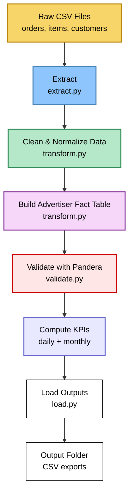

# 📊 Advertiser Analytics ETL Pipeline
### End-to-End Data Engineering Project (Python, Pandas, Logging, Validation)

This project builds a **production-style ETL pipeline** that processes raw marketplace data (Olist dataset) into **analytics-ready advertiser KPIs**.  
It mirrors real data engineering workflows used in retail media and marketplace analytics.

---

## 🚀 Project Summary

This ETL pipeline:

- Loads raw marketplace data (orders, items, customers, products)  
- Cleans, merges, and standardizes datasets  
- Builds an advertiser-level **fact table**  
- Computes daily & monthly KPIs  
- Validates data with **Pandera**  
- Logs every stage using a production-style logger  
- Saves analytics-ready CSV outputs  

The project follows a modular **src/** architecture similar to enterprise DE codebases.

---

## 🧱 Tech Stack

- Python 3.11  
- Pandas  
- Pandera  
- PyArrow  
- Logging  
- Pathlib  
- Conda environment  

---

## 📁 Project Structure

```
ms_ad_analytics_project/
│
├── data/                           # Raw input CSVs (ignored by Git)
├── output/                         # Final KPI outputs
│
├── src/
│   ├── extract.py                  # Extract step
│   ├── transform.py                # Clean, merge, build fact table
│   ├── validate.py                 # Pandera schemas
│   ├── load.py                     # Save outputs
│   ├── logger.py                   # Custom logger
│   ├── config.py                   # Settings + log level
│   ├── pipeline.py                 # Main ETL pipeline
│   └── __init__.py
│
├── advertiser_spend_analytics.ipynb
├── .gitignore
└── README.md
```

---

## 🏗️ Pipeline Architecture (Mermaid Diagram)



---

## 📊 KPIs Produced

| Metric | Description |
|--------|-------------|
| **orders** | Unique order count |
| **lines** | Items sold |
| **revenue** | price + freight (line-level revenue) |
| **customers** | Unique buyers |

Outputs are produced at two time grains:

- **Daily KPIs**
- **Monthly KPIs**

---

## ✅ Advertiser Fact Table

Includes:

- advertiser_id  
- order_id  
- customer_id  
- order_item_id  
- order_date  
- order_month  
- line_revenue  

This mirrors a **fact_sales** table used in enterprise analytics.

---

## ⚙️ How to Run the Pipeline

### 1. Create environment

```
conda create -n msad python=3.11 -y
conda activate msad
```

### 2. Install dependencies

```
pip install pandas pandera pyarrow python-dotenv pytest
```

### 3. Run ETL pipeline

```
python -m src.pipeline
```

### 4. Outputs appear in:

```
output/daily_advertiser_kpis.csv
output/monthly_advertiser_kpis.csv
```

---

## 🧪 Data Validation (Pandera)

Validation ensures:

- Correct schema  
- Correct dtypes  
- No negative revenue  
- Valid advertiser/order/customer IDs  
- Correct YYYY-MM month format  
- Clean timestamps  

If validation fails, the pipeline stops — matching production design.

---

## 📜 Logging

Example logs:

```
INFO | Starting ETL pipeline...
INFO | Extract completed successfully.
INFO | Fact table validation passed.
INFO | KPI computation complete.
INFO | Load complete. Files saved to /output.
```

---

## 🎯 Why This Project Matters

You demonstrate:

- ETL pipeline engineering  
- Fact table modeling  
- Data cleaning & standardization  
- KPI engineering  
- Validation & error handling  
- Logging & observability  
- Modular Python design  
- Reproducible environments  

Perfect for:

- Data Engineering  
- Analytics Engineering  
- Business Analytics  
- Data Analytics  

---

## 👤 Author

**Errol Brown**  
Data Engineering / Analytics
